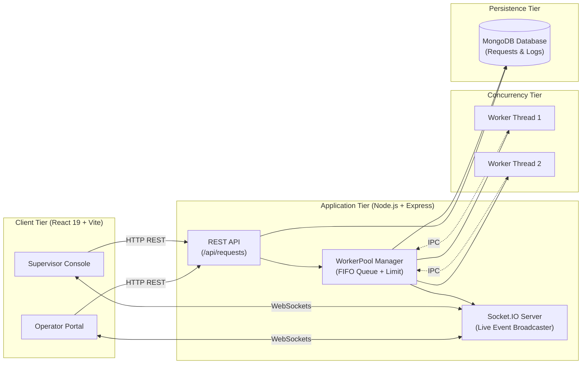

# OpsDesk — Real-Time Service Request Management System

A high-performance, full-stack service request management system designed for service organizations. It enables **Operators** to submit complex customer service tasks without interface lag, while **Supervisors** monitor multi-stage execution, throughput, and progress logs in real time via WebSockets and multi-threaded background workers.

---

## Features

- **Non-Blocking Ingestion**: Immediate API responses for long-running service requests.
- **Multi-Threaded Concurrency**: Bounded `WorkerPool` powered by Node.js `worker_threads` to process CPU-bound operations in parallel without starving the event loop.
- **Real-Time Live Updates**: Instant state, progress (0–100%), and stage updates broadcasted via **Socket.IO**.
- **Role-Based Workspaces**:
  - **Operator Portal**: Fast service intake form, realistic business templates, and submission tracking.
  - **Supervisor Console**: Live operational metrics (Active, Queued, Completed, Failed), search and filters, table/grid view toggling, and request cancellation.
- **Cooperative Cancellation**: Cancel pending queue jobs or actively running worker thread tasks on-demand.
- **Progress Audit Trail**: Append-only checkpoint logging persisting every stage transition with timestamps in MongoDB.
- **Late-Join Hydration**: Newly connected supervisor dashboards receive active request state on initial connection.
- **Automated Testing Suite**: Full integration test coverage using Vitest, Supertest, and MongoMemoryServer.

---

## Technology Stack

- **Frontend**: React 19, TypeScript, Vite, Tailwind CSS, TanStack React Query v5, Zustand, Lucide React, Socket.IO Client.
- **Backend**: Node.js, Express 4, TypeScript, Socket.IO v4, Zod, express-rate-limit, cors.
- **Concurrency**: Node.js `worker_threads`.
- **Database**: MongoDB with Mongoose 8.
- **Testing**: Vitest, Supertest, MongoMemoryServer.

---

## Architecture Overview



---

## Project Structure

```
AoishyTask/
├── SYSTEM_ANALYSIS.md          # Business problem, requirements, scope, NFRs
├── SYSTEM_DESIGN.md            # Architecture, schemas, API, WebSockets, Concurrency
├── IMPLEMENTATION.md           # Implementation breakdown, lifecycle, testing
├── README.md                   # Project overview & running instructions
│
├── server/                     # Backend Node.js / Express Application
│   ├── src/
│   │   ├── index.ts            # Server entrypoint
│   │   ├── app.ts              # Express application setup
│   │   ├── config/             # Typed config loader
│   │   ├── db/                 # MongoDB connection manager
│   │   ├── models/             # Mongoose schemas (ServiceRequest, ProgressLog)
│   │   ├── repositories/       # Data-access layer
│   │   ├── services/           # Business logic & worker dispatching
│   │   ├── controllers/        # Express HTTP controllers
│   │   ├── routes/             # API routes
│   │   ├── validation/         # Zod validation schemas
│   │   ├── middleware/         # Validation, rate limiting, error handling
│   │   ├── socket/             # Socket.IO handlers and hydration
│   │   ├── workers/            # WorkerPool & requestProcessor.worker
│   │   └── __tests__/          # Vitest integration tests
│   └── package.json
│
└── client/                     # Frontend React Application
    ├── src/
    │   ├── App.tsx             # Root component & providers
    │   ├── api/                # React Query hooks & Axios instance
    │   ├── components/         # Reusable UI components
    │   ├── hooks/              # useSocket WebSocket client hook
    │   ├── pages/              # OperatorPage & SupervisorPage
    │   └── store/              # Zustand role store
    └── package.json
```

---

## Prerequisites

Before running the application, make sure you have the following installed:

- **Node.js**: `v18.0.0` or higher (LTS recommended)
- **npm**: `v9.0.0` or higher
- **MongoDB**: Local MongoDB community server running on port `27017` (or a MongoDB Atlas connection string).

---

## Environment Variables

### Backend Configuration (`server/.env`)

Create a `.env` file in the `server/` directory:

```env
# Server Configuration
NODE_ENV=development
PORT=5000

# Database Configuration
MONGODB_URI=mongodb://localhost:27017/service-requests

# CORS Configuration
CORS_ORIGIN=http://localhost:5173

# Concurrency Worker Configuration
MAX_WORKERS=5

# Rate Limiting Configuration
RATE_LIMIT_WINDOW_MS=60000
RATE_LIMIT_MAX_REQUESTS=20
```

### Frontend Configuration (`client/.env`)

```env
# Optional: defaults to proxy on port 5173
VITE_API_BASE_URL=/api
```

---

## Installation

Clone the repository and install dependencies for both server and client:

```bash
# 1. Install Backend Dependencies
cd server
npm install

# 2. Install Frontend Dependencies
cd ../client
npm install
```

---

## Running the Application

### 1. Start MongoDB
Ensure MongoDB is running locally:
```bash
# Example for MongoDB service
mongod --dbpath /path/to/data/db
```

### 2. Start the Backend Server
```bash
cd server
npm run dev
```
*The server will start at `http://localhost:5000` with WebSocket support enabled.*

### 3. Start the Frontend Client
In a new terminal window:
```bash
cd client
npm run dev
```
*The client will start at `http://localhost:5173`.*

---

## API Documentation

Base URL: `http://localhost:5000/api/requests`

| Method | Endpoint | Description | Query / Body Parameters |
| :--- | :--- | :--- | :--- |
| `POST` | `/api/requests` | Create and enqueue a service request | Body: `{ title, description, priority, submittedBy }` |
| `GET` | `/api/requests` | List requests with pagination and filters | Query: `page, limit, status, priority, submittedBy, search, sortBy, sortOrder` |
| `GET` | `/api/requests/:id` | Get single request details | Path: `:id` (24-char ObjectId) |
| `POST` | `/api/requests/:id/cancel` | Cancel a pending or processing request | Path: `:id` (24-char ObjectId) |
| `GET` | `/api/requests/:id/progress`| Get full progress audit log entries | Path: `:id` (24-char ObjectId) |
| `GET` | `/health` | Server health check endpoint | None |

---

## WebSocket Events

| Event Name | Direction | Description |
| :--- | :--- | :--- |
| `requests:initial-state` | Server → Client | Emits initial active request snapshot to newly connected client. |
| `request:created` | Server → All | Broadcasts newly submitted service request. |
| `request:status-updated` | Server → All | Broadcasts status change (e.g. from `pending` to `processing`). |
| `request:progress-updated`| Server → All | Broadcasts live stage progress percentage and stage message. |
| `request:completed` | Server → All | Broadcasts request completion (100%). |
| `request:failed` | Server → All | Broadcasts processing error details and termination. |
| `request:cancelled` | Server → All | Broadcasts cancellation state. |

---

## Concurrency & Background Processing

- **Thread Pool Architecture**: The `WorkerPool` regulates active worker threads (`MAX_WORKERS=5`).
- **Isolation**: Work is processed inside Node.js `Worker Threads` (`worker_threads`), executing prime-sieve computations in chunked cycles.
- **Responsiveness**: The Express main thread never executes long-running CPU loops, ensuring sub-50ms API responsiveness.
- **Cancellation**: Supports non-destructive cancellation of queued jobs or running worker tasks via inter-process message passing.

---

## Testing

The backend includes automated API integration tests running against an in-memory MongoDB database:

```bash
cd server
npm test
```

To run tests in watch mode:
```bash
cd server
npm run test:watch
```

The API tests cover request validation, persistence, listing, filtering, pagination, cancellation,
progress-log retrieval, and error responses. Worker Threads and Socket.IO are mocked in this suite;
the live worker lifecycle should be verified manually by running the application and observing a
request move from `pending` to `processing` and then `completed` in two browser views.

---

## Production Build

### Build Backend
```bash
cd server
npm run build
npm start
```

### Build Frontend
```bash
cd client
npm run build
npm run preview
```

---

## Troubleshooting

1. **`MongoDB Connection Error`**:
   - Ensure MongoDB is running on `mongodb://localhost:27017`.
   - Update `MONGODB_URI` in `server/.env` if using a remote MongoDB Atlas cluster.
2. **`Port Already in Use`**:
   - Change `PORT` in `server/.env` and update the proxy port in `client/vite.config.ts`.
3. **`Worker script not found in production`**:
   - Running `npm run build` compiles `requestProcessor.worker.ts` to `dist/workers/requestProcessor.worker.js`.

---

## Assumptions

- **Service Request Domain**: Requests represent compute-intensive operational workflows with 6 stages (*Validation, Allocation, Analysis, Processing, Quality Check, Finalization*).
- **Authentication**: Role simulation is handled via client workspace toggling without backend JWT authentication.
- **Single Server Node**: The system assumes a single Node.js instance; multi-server horizontal scaling would require Redis Pub/Sub.

---

## Future Improvements

- **Authentication & RBAC**: JWT authentication with password hashing and role-based route guards.
- **Distributed Queuing**: Redis-backed BullMQ queue for multi-node worker distribution.
- **Webhook Subscriptions**: Configurable webhook alerts for external customer systems on request completion.
