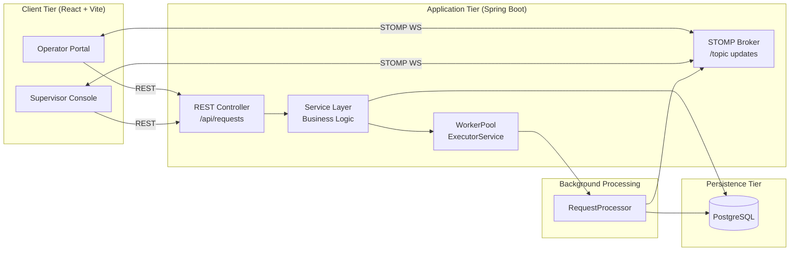

# OpsDesk — Real-Time Service Request Management System

OpsDesk is a full-stack service request management platform built around a Spring Boot backend, PostgreSQL persistence, and a React frontend for role-based operational monitoring. Operators submit service requests without waiting for completion, while supervisors track progress, monitor active workloads, and receive live updates through STOMP-based WebSocket broadcasts.

---

## Features

- Non-blocking request intake with asynchronous background execution.
- Spring Boot backend built with Java 21 and JPA for PostgreSQL persistence.
- Fixed-thread worker pool for processing request lifecycle stages in parallel.
- Live status and progress updates over STOMP WebSocket topics.
- Operator and supervisor role views in the React client.
- Request cancellation for pending or processing work items.
- Progress audit logs persisted per request for traceability.
- Automatic lifecycle updates from pending to processing to completed, failed, or cancelled.

---

## Technology Stack

- Frontend: React, TypeScript, Vite, Tailwind CSS
- Backend: Spring Boot 4.1.1, Java 21, Spring Web MVC, Spring Security, Spring WebSocket, Spring Data JPA
- Database: PostgreSQL
- Real-time communication: STOMP over WebSockets
- Concurrency: Java ExecutorService-based worker pool
- Validation: Jakarta Validation / Bean Validation

---

## Architecture Overview



---

## Project Structure

```text
AoishyTask/
├── README.md
├── SYSTEM_ANALYSIS.md
├── SYSTEM_DESIGN.md
├── IMPLEMENTATION.md
├── client/                         # React frontend
│   ├── package.json
│   ├── src/
│   └── README.md
├── service-request-server/         # Spring Boot backend
│   ├── pom.xml
│   ├── mvnw
│   ├── src/
│   └── application.properties
└── task
```

---

## Prerequisites

- Java 21
- Maven 3.9+
- PostgreSQL 14 or newer
- Node.js 18+ and npm

---

## Environment Setup

### 1. Create the PostgreSQL database

```sql
CREATE DATABASE service_request_db;
```

### 2. Configure the backend datasource

The Spring configuration is in `service-request-server/src/main/resources/application.properties`:

```properties
spring.application.name=service-request-server

spring.datasource.url=jdbc:postgresql://localhost:5432/service_request_db
spring.datasource.username=postgres
spring.datasource.password=postgres123

spring.jpa.hibernate.ddl-auto=update
spring.jpa.show-sql=true
spring.jpa.properties.hibernate.format_sql=true

server.port=8080
```

---

## Running the Application

### Backend

```bash
cd service-request-server
./mvnw spring-boot:run
```

The backend runs on:

- http://localhost:8080
- WebSocket endpoint: ws://localhost:8080/ws

### Frontend

```bash
cd client
npm install
npm run dev
```

The frontend runs on:

- http://localhost:5173

---

## API Overview

Base path: `/api/requests`

| Method | Endpoint | Description |
| --- | --- | --- |
| POST | `/api/requests` | Create a new service request |
| GET | `/api/requests` | List requests with filter and pagination support |
| GET | `/api/requests/{id}` | Fetch a single request by ID |
| PATCH | `/api/requests/{id}/cancel` | Cancel a pending or processing request |
| GET | `/api/requests/{id}/progress` | Retrieve progress log entries |
| DELETE | `/api/requests/{id}` | Delete a request |

---

## WebSocket Topics

The backend currently publishes STOMP messages through the `/topic` broker.

| Topic | Direction | Description |
| --- | --- | --- |
| `/topic/request-created` | Server → Client | New request created |
| `/topic/request-status-updated` | Server → Client | Lifecycle changes such as processing start |
| `/topic/request-progress-updated` | Server → Client | Progress stage and percentage updates |
| `/topic/request-completed` | Server → Client | Request completion |
| `/topic/request-failed` | Server → Client | Request failure |
| `/topic/request-cancelled` | Server → Client | Request cancellation |

---

## Concurrency Model

The backend uses a Java `ExecutorService`-backed worker pool with bounded concurrency. Each request is submitted to the pool after successful database insert and commit, then processed asynchronously by the request processor. The processor advances through lifecycle stages, writes progress logs, updates request state, and emits WebSocket notifications.

---

## Testing

Run the backend test suite with:

```bash
cd service-request-server
./mvnw test
```

The current implementation includes Spring Boot test support for validation, persistence, and controller-level behavior.

---

## Notes

- Role switching is handled in the client-state layer rather than by a formal authentication system.
- Security is enabled through Spring Security but the current scope focuses on the operational workflow rather than production RBAC or JWT authentication.
- The system is designed as a single-node service and does not currently include a distributed queue or multi-node WebSocket clustering.

### Build Backend
```bash
cd service-request-server
./mvnw clean package
```

### Build Frontend
```bash
cd client
npm run build
```

---

## Troubleshooting

1. **PostgreSQL connection error**:
   - Ensure PostgreSQL is running and the database `service_request_db` exists.
   - Verify the datasource credentials in `service-request-server/src/main/resources/application.properties`.
2. **Port already in use**:
   - Change the backend port in `application.properties` if needed.
   - Update any frontend configuration pointing to the backend URL.
3. **WebSocket connection issues**:
   - Confirm the backend is running on port 8080 and the endpoint is `/ws`.

---

## Assumptions

- **Service Request Domain**: Requests represent asynchronous operational workflows with a standard lifecycle.
- **Authentication**: Role simulation is handled in the client without a full production auth layer.
- **Single Node Deployment**: The current design assumes one application instance; distributed scaling would require additional queueing and clustering work.

---

## Future Improvements

- Authentication and RBAC with JWT or OAuth2.
- Database migration tooling such as Flyway or Liquibase.
- Production-grade deployment security including TLS and secrets management.
- Distributed queueing for larger multi-instance workloads.
