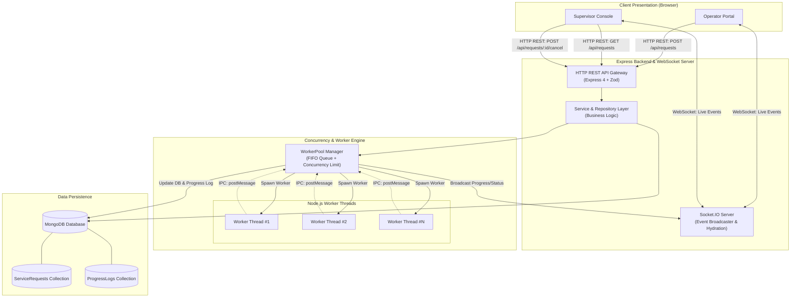
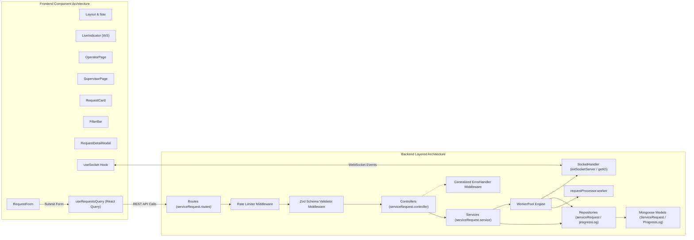
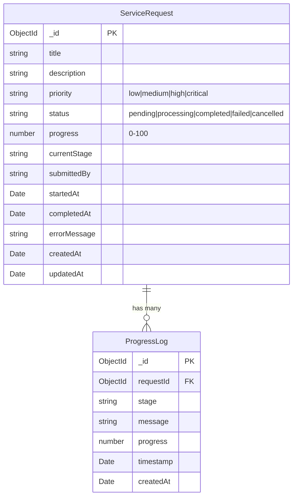
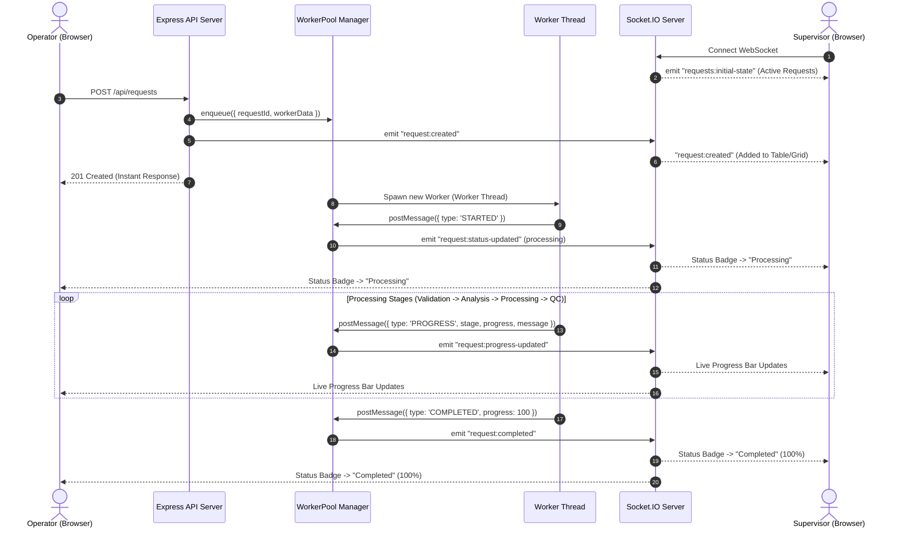

# SYSTEM DESIGN: Real-Time Service Request Management System

## 1. Architecture Overview

The system is architected as a decoupled, multi-tier full-stack application composed of:

1. **Frontend Presentation Tier**: A Single-Page Application (SPA) built with React 19, TypeScript, and Vite. It utilizes TanStack Query for server-state caching and synchronization, Zustand for local role management, and Socket.IO Client for bidirectional live event subscription.
2. **Application & API Tier**: An Express.js server in TypeScript implementing a layered architecture (Routes → Controllers → Services → Repositories → Models). It manages HTTP REST communication, Zod input validation, rate limiting, and centralized error handling.
3. **Real-Time Communication Tier**: A Socket.IO WebSocket server mounted directly on the HTTP server instance, broadcasting state mutations to connected clients and performing late-join hydration.
4. **Background Concurrency Tier**: A dedicated `WorkerPool` managing true parallel execution via Node.js `worker_threads`. CPU-bound multi-stage tasks run in dedicated operating-system-level threads, isolating heavy computations from the Express event loop.
5. **Persistence Tier**: MongoDB using Mongoose ODM with indexed collections for service requests and immutable append-only progress logs.

---

## 2. High-Level Architecture Diagram



---

## 3. Component Diagram



---

## 4. Project Structure

```
AoishyTask/
├── SYSTEM_ANALYSIS.md          # Business problem, requirements, scope, NFRs
├── SYSTEM_DESIGN.md            # Architecture, schemas, API, WebSockets, Concurrency
├── IMPLEMENTATION.md           # Implementation breakdown, lifecycle, testing
├── README.md                   # Getting started, environment setup, API docs
│
├── server/                     # Backend Node.js / Express Application
│   ├── .env.example            # Environment configuration template
│   ├── package.json            # Server dependencies and scripts
│   ├── tsconfig.json           # TypeScript configuration
│   ├── vitest.config.ts        # Vitest test configuration
│   └── src/
│       ├── index.ts            # Entrypoint: DB connect, HTTP server, WorkerPool, Sockets
│       ├── app.ts              # Express application setup & middleware registration
│       ├── config/             # Typed environment configuration loader
│       ├── db/                 # MongoDB Mongoose connection manager
│       ├── models/             # Mongoose schemas: ServiceRequest, ProgressLog
│       ├── repositories/       # Data-access abstraction layer
│       ├── services/           # Core business logic & worker dispatching
│       ├── controllers/        # Thin HTTP request/response handlers
│       ├── routes/             # Express route declarations
│       ├── validation/         # Zod schemas for request validation
│       ├── middleware/         # Validation, rate limiting, error handling
│       ├── socket/             # Socket.IO initialization and hydration logic
│       ├── workers/            # WorkerPool class & requestProcessor.worker thread
│       ├── types/              # Shared backend TypeScript interfaces
│       └── __tests__/          # Vitest integration tests with MongoMemoryServer
│
└── client/                     # Frontend React SPA Application
    ├── index.html              # HTML entrypoint with Inter font
    ├── package.json            # Client dependencies and scripts
    ├── vite.config.ts          # Vite configuration with /api & /socket.io proxy
    ├── tailwind.config.ts      # Tailwind CSS configuration
    └── src/
        ├── main.tsx            # React DOM root render
        ├── App.tsx             # QueryClientProvider & layout wrapper
        ├── index.css           # Global Tailwind and scrollbar styling
        ├── api/                # Axios client & TanStack Query hooks
        ├── components/         # Reusable UI components (Form, Card, Table, Modal, Badges)
        ├── hooks/              # useSocket WebSocket client hook
        ├── pages/              # OperatorPage and SupervisorPage
        ├── store/              # Zustand roleStore for role switching
        ├── types/              # Frontend TypeScript types
        └── utils/              # ClassName merging helpers (cn)
```

---

## 5. Database Design

The system utilizes MongoDB via Mongoose. The database design comprises two main collections:

### 1. `ServiceRequest` Collection
Stores metadata, status, progress percentage, current stage, and lifecycle timestamps for each service task.

| Field | Type | Required | Constraints / Default | Description |
| :--- | :--- | :--- | :--- | :--- |
| `_id` | `ObjectId` | Auto | Primary Key | MongoDB Document identifier |
| `title` | `String` | Yes | Min: 3, Max: 100, Trim | Brief title of the service request |
| `description` | `String` | Yes | Min: 10, Max: 1000, Trim | Detailed operational instructions |
| `priority` | `String` | Yes | Enum: `low`, `medium`, `high`, `critical` | Task urgency level |
| `status` | `String` | Yes | Enum: `pending`, `processing`, `completed`, `failed`, `cancelled` (Default: `pending`) | Current lifecycle state |
| `progress` | `Number` | Yes | Min: 0, Max: 100 (Default: 0) | Completion percentage |
| `currentStage`| `String` | No | Trim | Name of the active processing phase |
| `submittedBy` | `String` | Yes | Max: 50, Trim | Submitter / Operator name |
| `startedAt` | `Date` | No | Optional timestamp | Time background processing began |
| `completedAt` | `Date` | No | Optional timestamp | Time processing finished or terminated |
| `errorMessage`| `String` | No | Trim | Reason for failure if status is `failed` |
| `createdAt` | `Date` | Auto | Mongoose Timestamp | Record creation timestamp |
| `updatedAt` | `Date` | Auto | Mongoose Timestamp | Record last update timestamp |

#### Indexes:
- `status: 1`
- `priority: 1`
- `submittedBy: 1`
- `createdAt: -1`
- `status: 1, priority: 1` (Compound)
- `title: 'text', description: 'text'` (Full-Text Search Index)

---

### 2. `ProgressLog` Collection
Stores an immutable, append-only chronological log of checkpoints emitted during background processing.

| Field | Type | Required | Constraints / Default | Description |
| :--- | :--- | :--- | :--- | :--- |
| `_id` | `ObjectId` | Auto | Primary Key | Log entry identifier |
| `requestId` | `ObjectId` | Yes | Reference: `ServiceRequest` | Foreign reference to parent request |
| `stage` | `String` | Yes | Trim | Name of the completed checkpoint stage |
| `message` | `String` | Yes | Trim | Diagnostic description of checkpoint |
| `progress` | `Number` | Yes | Min: 0, Max: 100 | Progress percentage at checkpoint |
| `timestamp` | `Date` | Yes | Default: `Date.now` | Checkpoint execution timestamp |
| `createdAt` | `Date` | Auto | Mongoose Timestamp | Entry persistence timestamp |

#### Indexes:
- `requestId: 1`
- `timestamp: 1`



---

## 6. API Design

Base URL: `/api/requests`

### Endpoints Summary

| Method | Endpoint | Description | Auth | Rate Limited |
| :--- | :--- | :--- | :--- | :--- |
| `POST` | `/api/requests` | Create and enqueue a service request | No | Yes (20 req/min) |
| `GET` | `/api/requests` | List requests with filtering, search & pagination | No | No |
| `GET` | `/api/requests/:id` | Get single request details | No | No |
| `POST` | `/api/requests/:id/cancel` | Cancel a pending or processing request | No | No |
| `GET` | `/api/requests/:id/progress`| Get full progress audit log entries | No | No |
| `GET` | `/health` | Server health check endpoint | No | No |

---

### Endpoint Specifications

#### 1. `POST /api/requests`
- **Request Body (JSON)**:
  ```json
  {
    "title": "Customer Data Migration",
    "description": "Migrate customer database records with integrity checks.",
    "priority": "high",
    "submittedBy": "Alex Mercer"
  }
  ```
- **Response `201 Created`**:
  ```json
  {
    "success": true,
    "data": {
      "request": {
        "_id": "66c888b1f81d4e0012345678",
        "title": "Customer Data Migration",
        "description": "Migrate customer database records with integrity checks.",
        "priority": "high",
        "status": "pending",
        "progress": 0,
        "submittedBy": "Alex Mercer",
        "createdAt": "2026-08-24T10:00:00.000Z",
        "updatedAt": "2026-08-24T10:00:00.000Z"
      }
    }
  }
  ```
- **Error Codes**: `400 Validation Error`, `429 Too Many Requests`, `500 Server Error`.

#### 2. `GET /api/requests`
- **Query Parameters**:
  - `page` (default: 1)
  - `limit` (default: 10, max: 50)
  - `status` (`pending` | `processing` | `completed` | `failed` | `cancelled`)
  - `priority` (`low` | `medium` | `high` | `critical`)
  - `submittedBy` (string search)
  - `search` (full-text search across title & description)
  - `sortBy` (`createdAt` | `updatedAt` | `priority` | `status`)
  - `sortOrder` (`asc` | `desc`, default: `desc`)
- **Response `200 OK`**:
  ```json
  {
    "success": true,
    "data": {
      "requests": [ /* array of requests */ ],
      "pagination": {
        "total": 45,
        "page": 1,
        "limit": 10,
        "totalPages": 5
      }
    }
  }
  ```

#### 3. `POST /api/requests/:id/cancel`
- **Path Parameter**: `id` (24-character hex MongoDB ObjectId)
- **Response `200 OK`**:
  ```json
  {
    "success": true,
    "data": {
      "request": {
        "_id": "66c888b1f81d4e0012345678",
        "status": "cancelled",
        "completedAt": "2026-08-24T10:02:15.000Z"
      }
    }
  }
  ```
- **Error Codes**: `404 Not Found`, `422 Invalid State` (if request is already completed/failed).

---

## 7. WebSocket Communication

Socket.IO is configured with CORS origin matching `CORS_ORIGIN`.

### Event Catalog

| Event Name | Direction | Trigger Condition | Payload Structure |
| :--- | :--- | :--- | :--- |
| `requests:initial-state` | Server → Client | Emitted to a newly connected socket | `{ requests: IServiceRequest[] }` |
| `request:created` | Server → Broadcast | Operator creates request via API | `{ request: IServiceRequest }` |
| `request:status-updated` | Server → Broadcast | Request changes status to `processing` | `{ requestId, status, currentStage, startedAt, updatedAt }` |
| `request:progress-updated` | Server → Broadcast | Worker finishes a processing stage | `{ requestId, progress, currentStage, message, timestamp }` |
| `request:completed` | Server → Broadcast | Worker finishes final stage (100%) | `{ requestId, status: 'completed', progress: 100, completedAt }` |
| `request:failed` | Server → Broadcast | Worker encounters uncaught error | `{ requestId, status: 'failed', errorMessage, completedAt }` |
| `request:cancelled` | Server → Broadcast | User requests cancellation | `{ requestId, status: 'cancelled', completedAt }` |

### Real-Time Event Sequence



---

## 8. Concurrency Model

### WorkerPool Architecture

The background execution engine utilizes Node.js **Worker Threads (`worker_threads`)**, not simple asynchronous timers.

```mermaid
flowchart TB
    subgraph MainThread ["Main Thread (Event Loop)"]
        Ingest["Incoming Request"] --> Enqueue["enqueue()"]
        Enqueue --> Queue[("FIFO Job Queue\n[Job 1, Job 2, ...]")]
        Queue --> Dispatcher{"Slots Available?\n(activeCount < MAX_WORKERS)"}
        Dispatcher -->|Yes| SpawnWorker["Spawn new Worker()"]
        Dispatcher -->|No| WaitQueue["Wait in Queue"]
    end

    subgraph WorkerPoolSlots ["Active Worker Slots (Max: MAX_WORKERS)"]
        SpawnWorker --> WSlot1["Worker #1\n(requestProcessor.worker)"]
        SpawnWorker --> WSlot2["Worker #2\n(requestProcessor.worker)"]
        SpawnWorker --> WSlot3["Worker #3\n(requestProcessor.worker)"]
    end

    subgraph WorkerExecution ["Worker Thread Internal"]
        WSlot1 --> ChunkLoop["Chunked Execution (100ms chunks)\n+ Prime Sieve CPU Work"]
        ChunkLoop --> CheckCancel{"Cancel Signal\nReceived?"}
        CheckCancel -->|No| StagePass["Stage Checkpoint Emit"]
        CheckCancel -->|Yes| Terminate["Emit CANCELLED & Exit"]
    end

    StagePass -.->|postMessage| Ingest
    WSlot1 -.->|Worker exit (code 0)| FreeSlot["Slot Freed -> Next in Queue"]
    FreeSlot --> Dispatcher
```

### Key Concurrency Mechanics
1. **Thread Bounding**: Regulated by `MAX_WORKERS` (default: 5) to prevent thread exhaustion under load.
2. **Main Thread Isolation**: No MongoDB connections or database queries exist inside worker threads; workers communicate strictly via `parentPort.postMessage()` IPC, leaving main thread to persist logs.
3. **Cooperative Cancellation**: Main thread sends `{ type: 'CANCEL' }` via IPC. Worker yields every 100ms (`setImmediate`) to inspect flags and abort safely.
4. **Queue Draining**: On worker exit (`worker.on('exit')`), the pool automatically pops and starts the next job in the FIFO queue.

---

## 9. Technology Stack Justification

| Technology | Selection | Justification |
| :--- | :--- | :--- |
| **Frontend Framework** | React 19 + TypeScript + Vite | Component-based state model, instantaneous HMR dev build, type-safety across props and payloads. |
| **Server State Manager** | TanStack React Query v5 | Automatic background query refetching, cache invalidation, and query cache direct mutation on socket events. |
| **Real-Time Transport** | Socket.IO v4 | Robust WebSocket protocol with automatic fallback, reconnection backoff, and event-driven broadcasting. |
| **Backend Runtime** | Node.js + Express 4 + TypeScript | Non-blocking I/O ideal for API gateways and WebSocket servers; strict compile-time validation. |
| **Concurrency Engine** | Node.js `worker_threads` | True OS-level multi-threading in Node.js, ensuring CPU-bound operations do not block the event loop. |
| **Database & ODM** | MongoDB + Mongoose 8 | Flexible document schema well-suited for nested stage progress logs and high-write concurrency. |
| **Schema Validation** | Zod | Declarative, TypeScript-inferred input validation for query parameters and request bodies. |
| **Testing** | Vitest + Supertest + MongoMemoryServer | Lightning-fast test execution with fully isolated in-memory database instances. |

---

## 10. Error Handling Architecture

The backend implements a centralized error handling strategy:

1. **Custom AppError Hierarchy**:
   - `NotFoundError` (404)
   - `ValidationError` (400)
   - `InvalidStateError` (422)
   - `RateLimitError` (429)
2. **Global Error Middleware**: Traps thrown errors, formats uniform `{ success: false, error: { code, message, details } }` responses, and logs stack traces in development.
3. **Worker Crash Isolation**: Worker errors (`worker.on('error')`) trigger `handleWorkerCrash()` which marks the request as `failed` in MongoDB and broadcasts `request:failed` to clients, preventing server instability.

---

## 11. Configuration Management

Environment variables are loaded via `dotenv` and validated via a typed singleton ([config/index.ts](file:///e:/AoishyTask/server/src/config/index.ts)):

```typescript
export const config = {
  env: getEnv('NODE_ENV', 'development'),
  port: getEnvInt('PORT', 5000),
  mongodbUri: getEnv('MONGODB_URI', 'mongodb://localhost:27017/service-requests'),
  corsOrigin: getEnv('CORS_ORIGIN', 'http://localhost:5173'),
  maxWorkers: getEnvInt('MAX_WORKERS', 5),
  rateLimit: {
    windowMs: getEnvInt('RATE_LIMIT_WINDOW_MS', 60_000),
    maxRequests: getEnvInt('RATE_LIMIT_MAX_REQUESTS', 20),
  },
};
```

---

## 12. Security Considerations

### Implemented Security Measures
- **CORS Configuration**: Restricts WebSocket and HTTP origins to authorized client origin (`config.corsOrigin`).
- **Rate Limiting**: `express-rate-limit` enforces rate bounds on submission routes (`POST /api/requests`).
- **Input Sanitization & Validation**: Zod middleware strips extra fields and validates data lengths and enums.
- **Error Obfuscation**: Production errors hide internal stack traces from clients.

### Recommended Future Security Enhancements
- User authentication via JSON Web Tokens (JWT) or OAuth2 session cookies.
- Role-Based Access Control (RBAC) middleware verifying Supervisor vs Operator privileges.
- Production HTTPS/TLS termination and Secure WebSocket (`wss://`) transport.

---

## 13. Design Decisions and Trade-offs

1. **Worker Threads vs. External Task Broker (Redis/BullMQ)**:
   - *Decision*: Implemented embedded Node.js `worker_threads` with in-process FIFO queue.
   - *Trade-off*: Eliminates heavy external infrastructure dependencies (Redis) for self-contained execution, though limited to single-node scaling.
2. **Single Main Thread DB Access**:
   - *Decision*: Worker threads pass IPC messages; only main thread writes to MongoDB.
   - *Trade-off*: Avoids managing redundant database connection pools across dozens of ephemeral worker threads.
3. **Client-Side Cache Direct Patching**:
   - *Decision*: `useSocket` updates TanStack Query cache directly on status/progress events instead of triggering complete refetches.
   - *Trade-off*: Maximizes UI responsiveness and minimizes unnecessary database read queries during rapid progress increments.
