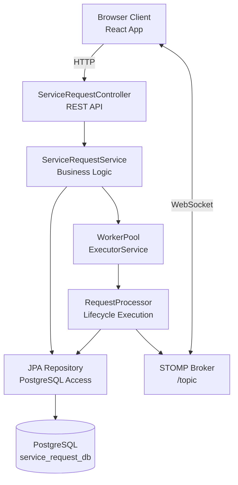
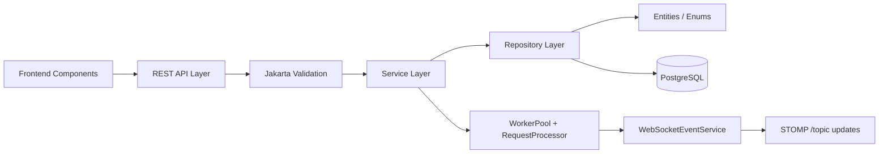
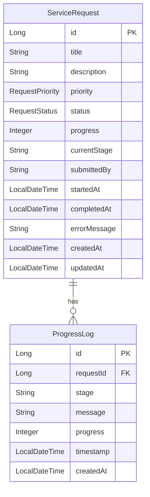
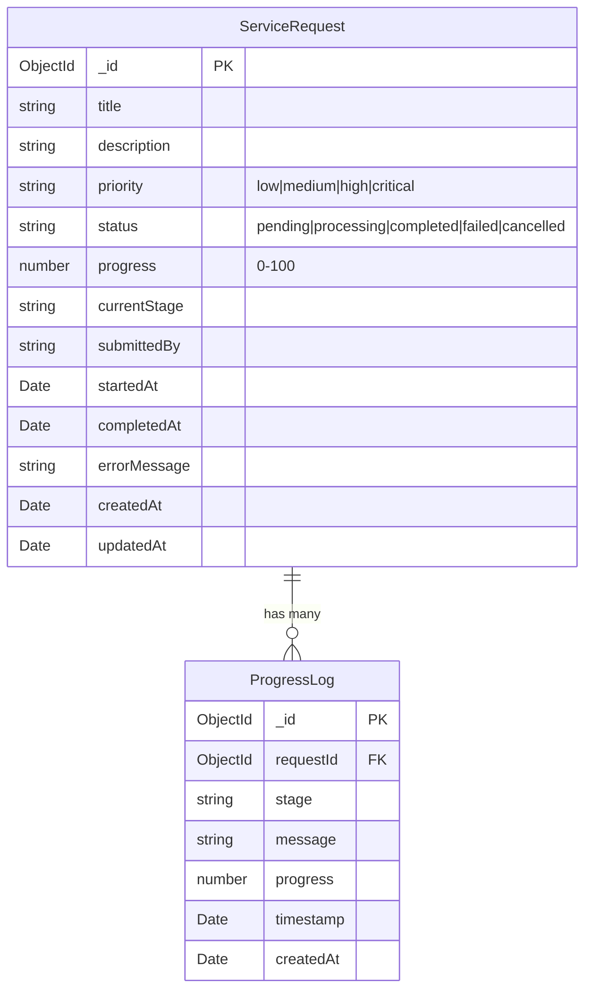
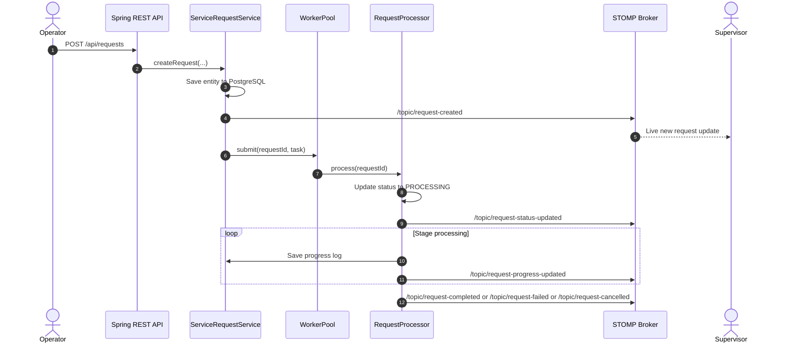
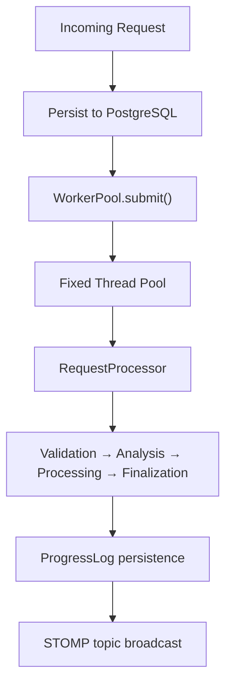

# SYSTEM DESIGN: Real-Time Service Request Management System

## 1. Architecture Overview

The system is built as a multi-tier application composed of:

1. Frontend presentation layer using React + TypeScript + Vite.
2. Spring Boot backend with REST controllers, service logic, validation, and WebSocket messaging.
3. PostgreSQL as the persistence layer.
4. Java worker pool for asynchronous request processing.
5. STOMP event distribution to connected clients.

---

## 2. High-Level Architecture Diagram



---

## 3. Component Design



---

## 4. Project Structure

```text
AoishyTask/
├── README.md
├── SYSTEM_ANALYSIS.md
├── SYSTEM_DESIGN.md
├── IMPLEMENTATION.md
├── client/
│   ├── package.json
│   ├── src/
│   └── README.md
├── service-request-server/
│   ├── pom.xml
│   ├── mvnw
│   ├── src/
│   │   ├── main/java/com/aoishy/servicerequest/
│   │   │   ├── config/
│   │   │   ├── controller/
│   │   │   ├── dto/
│   │   │   ├── entity/
│   │   │   ├── repository/
│   │   │   ├── service/
│   │   │   ├── websocket/
│   │   │   └── worker/
│   │   └── main/resources/application.properties
│   └── test/
└── task
```

---

## 5. Database Design

The persistence layer uses PostgreSQL with JPA entities.

### ServiceRequest

| Field | Type | Notes |
| --- | --- | --- |
| id | Long | Primary key |
| title | String | 3–100 chars |
| description | String | 10–1000 chars |
| priority | RequestPriority | Enum |
| status | RequestStatus | Enum |
| progress | Integer | 0–100 |
| currentStage | String | Current lifecycle stage |
| submittedBy | String | Submitter identifier |
| startedAt | LocalDateTime | Start timestamp |
| completedAt | LocalDateTime | Completion/cancel/failure time |
| errorMessage | String | Failure detail |
| createdAt | LocalDateTime | Creation time |
| updatedAt | LocalDateTime | Last update |

Indexes include:
- status
- priority
- submitted_by
- created_at
- status + priority

### ProgressLog

| Field | Type | Notes |
| --- | --- | --- |
| id | Long | Primary key |
| request | ServiceRequest | Many-to-one relation |
| stage | String | Stage name |
| message | String | Progress note |
| progress | Integer | Progress percentage |
| timestamp | LocalDateTime | Log timestamp |
| createdAt | LocalDateTime | Insert timestamp |

Indexes include:
- request_id
- timestamp



---

## 6. API Design

Base path: `/api/requests`

| Method | Endpoint | Purpose |
| --- | --- | --- |
| POST | `/api/requests` | Create a request |
| GET | `/api/requests` | List requests with filters |
| GET | `/api/requests/{id}` | Get a request |
| PATCH | `/api/requests/{id}/cancel` | Cancel a request |
| GET | `/api/requests/{id}/progress` | Get logs |
| DELETE | `/api/requests/{id}` | Delete a request |

The controller returns structured payloads using a common response wrapper:

```java
public record ApiResponse(boolean success, Object data) {}
```

---

## 7. WebSocket Design

The system uses Spring WebSocket with STOMP.

### Configuration
- STOMP endpoint: `/ws`
- Simple broker: `/topic`
- Application prefix: `/app`

### Broker Messages
- `/topic/request-created`
- `/topic/request-status-updated`
- `/topic/request-progress-updated`
- `/topic/request-completed`
- `/topic/request-failed`
- `/topic/request-cancelled`

This gives connected clients immediate updates without polling.

---

## 8. Concurrency Design

### WorkerPool
The `WorkerPool` is modeled around a Java `ExecutorService` with a fixed thread pool size. It tracks active request tasks by ID and supports cancellation requests.

### RequestProcessor
The `RequestProcessor` executes staged work and updates the request state incrementally. Each stage modifies:

- request status,
- progress value,
- current stage,
- updatedAt,
- progress log records,
- outbound WebSocket notifications.

### Lifecycle Sequence
1. Request is created and saved to PostgreSQL.
2. Service layer registers a job in the worker pool.
3. Background thread begins processing.
4. Each stage updates state and emits STOMP notifications.
5. Completion, failure, or cancellation resolves the lifecycle.

---

## 9. Security and Operational Notes

The backend currently includes Spring Security support and validation infrastructure; however, authentication and authorization are not yet fully hardened for production use. The design remains focused on request workflow correctness and real-time operational visibility.

Recommended future hardening:
- JWT-based authentication
- RBAC authorization checks
- environment-specific configuration secrets
- database migration tooling with Flyway/Liquibase
- HTTPS and deployment-level TLS



---

## 6. API Design

Base URL: `/api/requests`

### Endpoints Summary

| Method | Endpoint | Description | Auth | Rate Limited |
| :--- | :--- | :--- | :--- | :--- |
| `POST` | `/api/requests` | Create and enqueue a service request | No | Yes (20 req/min) |
| `GET` | `/api/requests` | List requests with filtering, search & pagination | No | No |
| `GET` | `/api/requests/:id` | Get single request details | No | No |
| `POST` | `/api/requests/:id/cancel` | Cancel a pending or processing request | No | No |
| `GET` | `/api/requests/:id/progress`| Get full progress audit log entries | No | No |
| `GET` | `/health` | Server health check endpoint | No | No |

---

## 7. WebSocket Communication

The system uses Spring WebSocket with STOMP for real-time communication.

### Broker Setup
- Endpoint: `/ws`
- Client subscription prefix: `/topic`
- Client send prefix: `/app`

### Event Catalog

| Event Topic | Direction | Purpose |
| --- | --- | --- |
| `/topic/request-created` | Server → Client | New request created |
| `/topic/request-status-updated` | Server → Client | Lifecycle status changed |
| `/topic/request-progress-updated` | Server → Client | Progress stage and percentage update |
| `/topic/request-completed` | Server → Client | Request reached 100% completion |
| `/topic/request-failed` | Server → Client | Request failed with error details |
| `/topic/request-cancelled` | Server → Client | Request cancelled |

### Real-Time Event Sequence



---

## 8. Concurrency Model

### WorkerPool Architecture

The backend uses a Java `ExecutorService` with a bounded thread pool and tracks active request tasks by ID.



### Key Concurrency Mechanics
1. The API thread remains responsive while processing continues in the background.
2. A fixed-size thread pool prevents excessive concurrent work.
3. Cancellation is handled by interrupting the active worker thread.
4. The main application writes persistence and emits notifications after each state transition.

---

## 9. Technology Stack Justification

| Technology | Selection | Justification |
| --- | --- | --- |
| Frontend | React + TypeScript + Vite | Quick UI iteration and strong typing |
| Backend | Spring Boot + Java 21 | Structured enterprise backend with MVC, JPA, WebSocket support |
| Real-time transport | STOMP over WebSocket | Clean pub/sub updates for connected dashboards |
| Database | PostgreSQL | Reliable relational storage and strong transactional integrity |
| Concurrency | Java ExecutorService | Simple bounded background task execution |
| Validation | Jakarta Validation | Clear server-side constraints for DTOs and entities |

---

## 10. Error Handling Architecture

The backend uses a layered approach to failure handling:

1. request validation rejects invalid payloads early,
2. service-level exceptions are surfaced to the controller layer,
3. processing failures are converted into failed request states,
4. notifications are emitted to connected clients for operational awareness.

---

## 11. Configuration Management

The main backend configuration is kept in `service-request-server/src/main/resources/application.properties`.

```properties
spring.application.name=service-request-server

spring.datasource.url=jdbc:postgresql://localhost:5432/service_request_db
spring.datasource.username=postgres
spring.datasource.password=postgres123

spring.jpa.hibernate.ddl-auto=update
spring.jpa.show-sql=true
spring.jpa.properties.hibernate.format_sql=true

server.port=8080
```

---

## 12. Security Considerations

### Current state
- Spring Security is included in the backend dependencies.
- Request validation and database constraints are enforced at the server layer.
- Client-side role switching is used for workflow separation, not production identity management.

### Recommended future improvements
- JWT or OAuth2 authentication.
- RBAC authorization checks by role.
- HTTPS/TLS for production deployment.
- Secrets management and environment-specific configuration.

---

## 13. Design Decisions and Trade-offs

1. Spring Boot + JPA over a custom Node backend:
   - Chooses a strong Java ecosystem and clear enterprise layering for a structured service workflow.
2. ExecutorService worker pool over external queue systems:
   - Keeps the implementation self-contained and easy to run locally without Redis or RabbitMQ.
3. Relational persistence in PostgreSQL:
   - Better suits transactional request state than a document-only storage model for structured lifecycle history.
